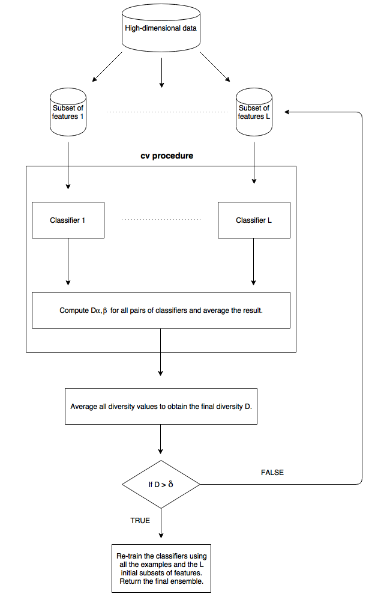

```{r setup, include=FALSE}
knitr::opts_chunk$set(echo = FALSE)
knitr::read_chunk("R/diversity-functions.R", labels = c("Q2"), 
                  from = c(80), to = c(150))
knitr::read_chunk("main.R", labels = c("Q3"), from = c(1), to = c(79))
```
## Question 01
<center></center>

The architecture developed for this question applies only for high-dimensional data. Ideally, the number of features should be much higher than the number `L` of classifiers in the ensemble.

An overview of the architecture is present in the above figure and a detailed explanation follows:

1. Choose a threshold $\delta$ for the minimum diversity of the system.
2. Split the data into `L` disjoint subsets of features each having approximately the same number of features.
3. Perform a stratified $k$-fold cross-validation procedure repeated $l$ times, computing at the end of each round the diversity $D_{\alpha, \beta}$ between all pairs of classifiers and averaging them to obtain $D^{k, l}_{\alpha, \beta}$.
4. Average the $k \times l$ diversity values obtained in the previous step to get the system's final diversity $D$.
  + If $D > \delta$ go to Step 5.
  + Else go to Step 2 and divide the original data into another `L` disjoint subsets of features.
5. Re-train all the classifiers using all the examples and the `L` disjoint subsets of features from Step 2. Return the final ensemble.

## Question 02
```{r Q2}
```
The `Measure of Difficulty` computes a measure of diversity using the histogram of the number of classifiers that correctly classified input examples. 

Define `N = # of examples`, `L = # of classifiers`, and `f(i) = # of examples correctly classified by i classifiers`. The proposed measure (called `Omega`) of diversity employs the same histogram but works in the following way:

1. Remove all the examples that were either misclassified or correctly classified by all the classifiers.
2. Compute the measure:
  + If `L` is even: $f(\frac{L}{2}) + \frac{1}{2} \times (f(\frac{L}{2} - 1) + f(\frac{L}{2} + 1)) + ... + \frac{1}{(\frac{L}{2})} \times (f(1) + f(L - 1))$
  + If `L` is odd: $(f(floor(\frac{L}{2})) + f(ceiling(\frac{L}{2}))) + \frac{1}{2} \times (f(floor(\frac{L}{2}) - 1) + f(ceiling(\frac{L}{2}) + 1)) + ... + \frac{1}{floor(\frac{L}{2})} \times (f(1) + f(L-1))$
3. Divide the previous sum by `N`.

It ranges from $0$ to $1$, with $0$ representing minimum diversity and $1$ represent maximum diversity.

The rationale behind the proposed measure is that high diversity is achieved when half (or approximately half) of the classifiers correctly classify an input example and the other half disagrees. Hence the highest weight in the summation is given to this group. Also, if all the classifiers give the same output for an input example, there is no diversity in their outputs and therefore these examples are removed in the first step.

To exemplify the measure, we compare it against the (scaled) `Measure of Difficulty` for two different scenarios. For the first scenario we have `N = 100`, `L = 7`, and each classifier has an individual accuracy `p = 0.6`. The second scenario differs only by the classifiers' individual accuracy, which is `p = 0.8`.

```{r, out.height='60%', out.width='50%'}
library(ggplot2)
set.seed(1234)
sim1 <- replicate(2, simulatePredictionsData(100, 0.6, 7), simplify = FALSE)
f <- function(x){
  x <- cbind(0:7, table(factor(x$correct_distribution, levels = 0:7)))
  x <- as.data.frame(x)
  names(x) <- c("L", "value")
  x[["L"]] <- as.factor(x[["L"]])
  x
}

dm11 <- difficultMeasure(sim1[[1]]$predictions, sim1[[1]]$y, scale = TRUE)
om11 <- omegaMeasure(sim1[[1]]$predictions, sim1[[1]]$y)

dm12 <- difficultMeasure(sim1[[2]]$predictions, sim1[[2]]$y, scale = TRUE)
om12 <- omegaMeasure(sim1[[2]]$predictions, sim1[[2]]$y)


sim1 <- lapply(sim1, f)
ggplot(sim1[[1]], aes(x = L, y = value)) + geom_bar(stat = "identity") + theme_bw() + labs(x = "Number L correct", y = "Number of occurrences")
ggplot(sim1[[2]], aes(x = L, y = value)) + geom_bar(stat = "identity") + theme_bw() + labs(x = "Number L correct", y = "Number of occurrences")
```

In the above two simulations (`p = 0.6`) we had the values `r print(dm11, digits = 4)` and `r print(dm12, digits = 4)` for the `Measure of Difficulty`, and the values `r print(om11, digits = 4)` and `r print(om12, digits = 4)` for the proposed measured. 

```{r, out.height='60%', out.width='50%'}
set.seed(1234)
sim2 <- replicate(2, simulatePredictionsData(100, 0.8, 7), simplify = FALSE)

dm21 <- difficultMeasure(sim2[[1]]$predictions, sim2[[1]]$y, scale = TRUE)
om21 <- omegaMeasure(sim2[[1]]$predictions, sim2[[1]]$y)

dm22 <- difficultMeasure(sim2[[2]]$predictions, sim2[[2]]$y, scale = TRUE)
om22 <- omegaMeasure(sim2[[2]]$predictions, sim2[[2]]$y)

sim2 <- lapply(sim2, f)
ggplot(sim2[[1]], aes(x = L, y = value)) + geom_bar(stat = "identity") + theme_bw() + labs(x = "Number L correct", y = "Number of occurrences")
ggplot(sim2[[2]], aes(x = L, y = value)) + geom_bar(stat = "identity") + theme_bw() + labs(x = "Number L correct", y = "Number of occurrences")
```

For the second scenario, we had the values `r print(dm21, digits = 4)` and `r print(dm22, digits = 4)` for the `Measure of Difficulty`, and the values `r print(om21, digits = 4)` and `r print(om22, digits = 4)` for the proposed measure.

For the first scenario, the proposed measure agreed with the `Measure of Difficulty`, identifying as having a higher diversity the second simulation. On the other hand, for the second scenario, the proposed measure identified both simulations as having the same diversity, while the `Measure of Difficulty` computed a slightly higher diversity for the second simulation.

## Question 03
```{r Q3, message=FALSE, warning=FALSE, cache=TRUE, include=FALSE}
```
For this question, the [Credit Approval Data Set](http://archive.ics.uci.edu/ml/datasets/Credit+Approval) was employed. It is a binary classification problem, containing $690$ examples described by $15$ attributes. The attributes are of mixed types and there a few missing values.

The base classifier for the bagging procedure was a Decision Tree. It was the version implemented in the `R` language `rpart` package. The parameters used were the defaults ones, apart from the `split` parameter which was set to `information gain`. All the parameters' default values and their definitions are available in the [documentation](https://cran.r-project.org/web/packages/rpart/rpart.pdf).

In order to analyse how the number of classifiers `L` affects the performance of the _Bagging_ algorithm, the following experimentation was conducted:

1. Setup a range of values for `L`.
2. For each value of `L` perform a stratified five-fold cross-validation procedure repeated two times, computing at each round the average individual accuracy, the ensemble accuracy, five pairwise diversity measures, and five non-pairwise diversity measures. For each performance measure computed take the mean value.

In particular, the range of values for `L` was `10, 20, ..., 100`. The five pairwise diversity measures were: Correlation, Q Statistic, Pairwise Kappa, Disagreement Measure, and the Double-Fault Measure. The five non-pairwise diversity measures were: Entropy, KW, Non-Pairwise Kappa, Measure of Difficulty, and the Omega Measure (this is the measure proposed in Question 02).

The following graph shows the results. It is an interactive graph, which means you can hover the mouse on the graph and see the real values, zoom by selecting an area of the graph (click twice to remove the zoom), and hide/show performance measures clicking on their names in the legend.

```{r, message=FALSE, warning=FALSE, out.width='100%'}
library(plotly)
library(RColorBrewer)
pal <- brewer.pal(nlevels(results_tidy$measure), "Set1")
pl <- plot_ly(results_tidy, x = L, y = value, color = measure, colors = pal)
pl <- layout(pl, yaxis = list(title = "Value"))
pl
```

Increasing the size of the ensemble does not seem to affect the ensemble accuracy and the average individual accuracy. A possible explanation for this might be the Decision Tree's default parameters. For instance, the default parameters when used to train the Decision Tree on the employed data set, may make individual Trees very similar independently of the bootstrap sample used to train it. Nevertheless, it is notable that the accuracy of the ensemble (using majority voting) is always higher than the average of the individual classifiers.

While the ensemble accuracy was high (usually over $85\%$), the diversity was low. For all values of `L`, the `Q` statistic was over $90\%$, meaning that the individual trees were making correct classifications together. This trend can also be confirmed looking at the values of the `Disagreement` measure, which were just above $10\%$.

Analysing the non-pairwise measures, we confirm again that diversity was deemed low. The `Entropy` measure fluctuated around $16\%$ and the (scaled) `Measure of Difficulty` oscillated around $60\%$.